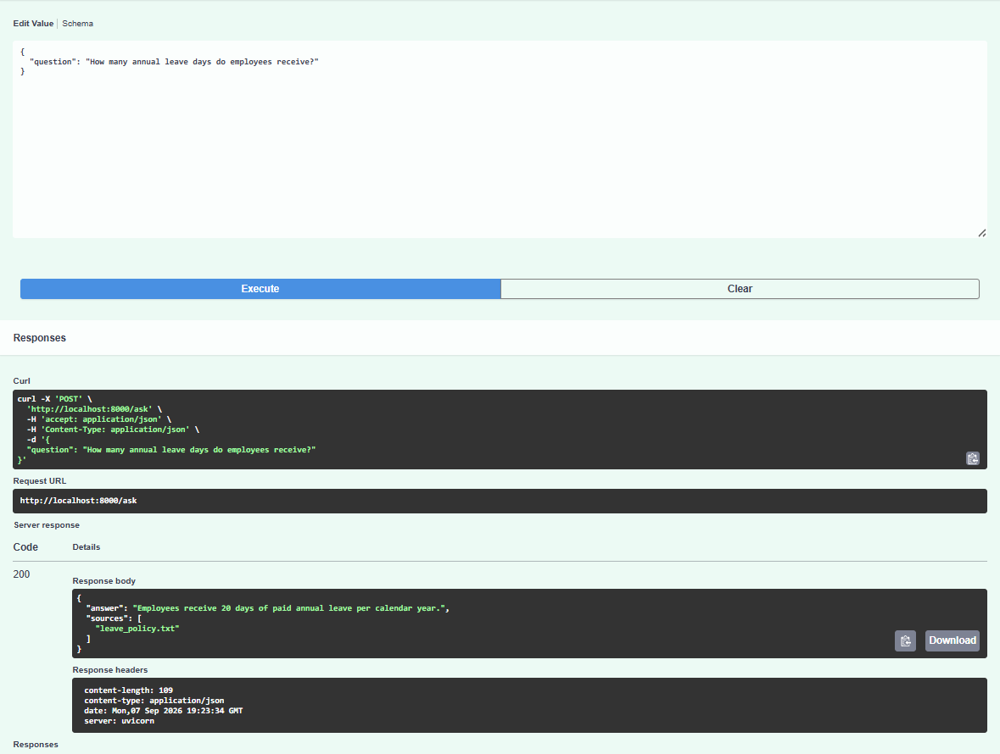

# Enterprise Knowledge Copilot

RAG backend for answering questions over enterprise documents using semantic vector retrieval and an LLM.

## Overview

Enterprise Knowledge Copilot is a FastAPI-based Retrieval-Augmented Generation (RAG) system that allows users to query an organization's internal knowledge base.

Instead of relying solely on an LLM's parametric knowledge, the system retrieves semantically relevant document content and provides it to the model as context before generating an answer. This helps ground responses in the available knowledge base and reduce unsupported answers.

## Architecture

```text
Documents
    ↓
Document ingestion
    ↓
Section-aware chunking
    ↓
Sentence-transformer embeddings
    ↓
Local vector index
    ↓
Query embedding
    ↓
Cosine similarity retrieval
    ↓
Top-k relevant chunks
    ↓
Groq LLM
    ↓
Grounded response + sources
    ↓
FastAPI REST API
```

## Features

- **Document ingestion** for `.txt` and `.md` files
- **Section-aware text chunking** with overlapping support for larger sections
- **Sentence-transformer embeddings** using a local vector index
- **Cosine similarity retrieval** for top-k semantic search
- **Retrieval-Augmented Generation (RAG)** integrated with the Groq LLM API
- **Grounded question answering** featuring source attribution and prompt-based safeguards against hallucinations
- **REST API development** featuring automated OpenAPI/Swagger documentation
- **Dockerized deployment** using Docker Compose
- **Lightweight evaluation dataset** pipeline for testing API accuracy

## Technology Stack

| Technology | Purpose |
| :--- | :--- |
| **Python** | Core application and RAG pipeline |
| **FastAPI** | REST API development |
| **Sentence Transformers** | Text embedding generation |
| **all-MiniLM-L6-v2** | Selected local embedding model |
| **NumPy** | Vector storage and cosine similarity computation |
| **Groq API** | LLM inference using OpenAI GPT-OSS models |
| **Pydantic** | Request/response data validation |
| **Uvicorn** | ASGI server for production-grade routing |
| **Docker & Docker Compose** | Containerized microservice environment |
| **python-dotenv** | Local environment configuration management |

## API Example

### Request
`POST /ask`
```json
{
  "question": "How many annual leave days do employees receive?"
}
```

### Response
```json
{
  "answer": "Full-time employees receive 20 days of paid annual leave.",
  "sources": [
    "leave_policy.txt"
  ]
}
```

## Running Locally

### Prerequisites
- Docker Desktop installed and running
- A valid Groq API key

### Setup & Deployment

1. **Clone the repository** and navigate to the project root directory.
2. **Configure environment variables** by creating a `.env` file in the project root:
   ```env
   GROQ_API_KEY=your_groq_api_key_here
   ```
3. **Populate the knowledge base** by placing your enterprise `.txt` or `.md` documents inside the `documents/` directory.
4. **Start the application** using Docker Compose:
   ```bash
   docker compose up
   ```
   
   > ⏳ **First-Time Boot Note:** The very first execution can take anywhere from **1 to 3 minutes** depending on your network speed. This delay occurs because the container must download the compressed AI embedding weights (~120MB) and initialize the underlying PyTorch math binaries. Subsequent server restarts will look at your cached local `data/index.pkl` volume asset and boot **instantly (< 10 seconds)**.
5. **Explore the API** interactively by opening the automatically generated Swagger UI page in your browser:
   ```text
   http://localhost:8000/docs
   ```

   

## Evaluation Pipeline

The repository includes a lightweight evaluation dataset and test runner for exercising the RAG API against predefined questions.

To run the evaluation locally:
1. Ensure the Docker API container is actively running.
2. Install the local development requirements:
   ```bash
   pip install -r requirements-dev.txt
   ```
3. Run the evaluation execution script:
   ```bash
   python evaluation/run_eval.py
   ```

The test runner reads queries from `evaluation/test_questions.json`, sends them to the live `/ask` endpoint, and captures returned answers and source telemetry into an evaluation report.

## Project Structure

```text
enterprise-knowledge-copilot/
│
├── app/
│   ├── main.py
│   ├── rag.py
│   └── schemas.py
│
├── documents/
│   ├── employee_handbook.txt
│   ├── leave_policy.txt
│   └── security_policy.txt
│
├── evaluation/
│   ├── test_questions.json
│   └── run_eval.py
│
├── scripts/
│   └── ingest.py
│
├── data/
│   └── index.pkl
│
├── assets/
│   └── swagger-ui.png
│
├── Dockerfile
├── docker-compose.yml
├── requirements.txt
├── requirements-dev.txt
├── .env.example
└── README.md
```

## Limitations

This project is a lightweight reference implementation rather than a production enterprise deployment. Current limitations include:
- Uses synthetic enterprise documents for demonstration purposes.
- Leverages an in-memory pickle vector index rather than a dedicated production vector database.
- Retrieval relies purely on semantic similarity without hybrid keyword search filtering.
- Lacks authentication, authorization, or document-level access control layers.
- Does not preserve conversation context or multi-turn history.
- Missing enterprise-grade cloud observability, metrics, and tracing instrumentation.

## Future Improvements

- [ ] Implement hybrid keyword/vector retrieval pipelines.
- [ ] Migrate the index storage to a dedicated engine like `pgvector`.
- [ ] Expand retrieval precision and recall benchmarking tools.
- [ ] Add enterprise authentication (OAuth2 / RBAC) and document-level ACLs.
- [ ] Implement text streaming tokens for the API responses.
- [ ] Incorporate conversation state management for chat support.
- [ ] Transition document processing to an asynchronous worker queue topology.
- [ ] Integrate OpenTelemetry tracking for cloud observability.
